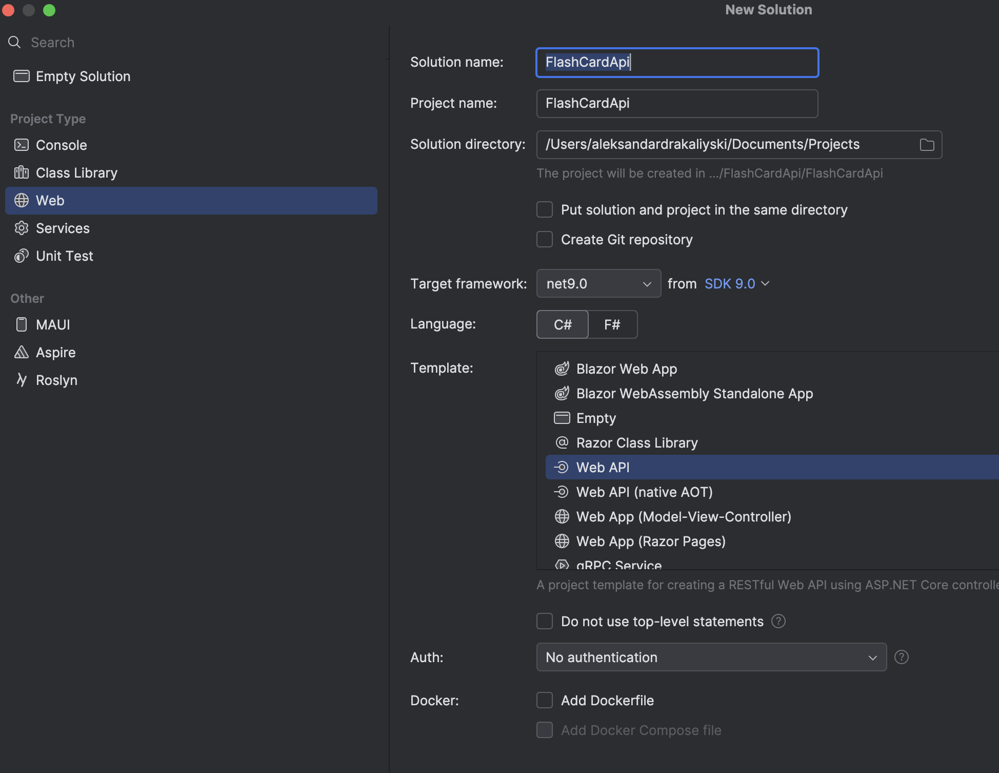
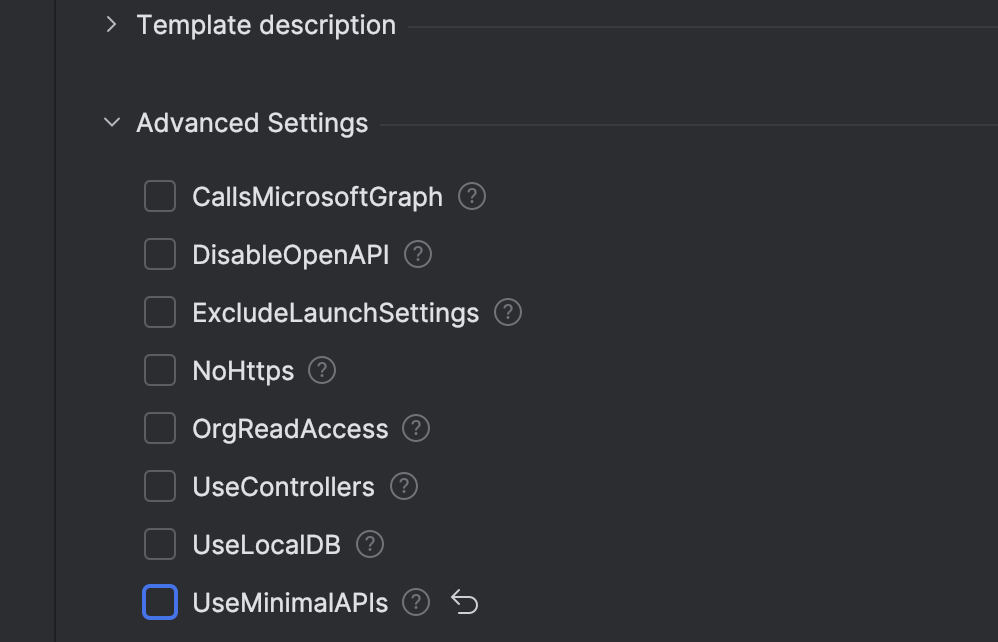
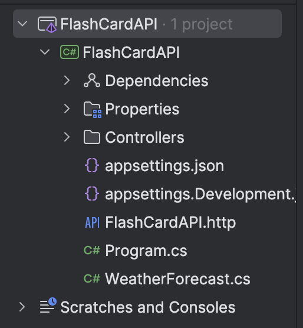

# How to create controller based APIs in .NET Core

## Learn how to create a basic CRUD API using C# and .NET 9.0


### Introduction

In this blog post I will create a simple controller based API for a flash card application using .NET Core 9.0 and Rider as my IDE of choice. If you are using Visual Studio or VSCode you can follow the official Microsoft documentation from which this blog was inspired by clicking
[here](https://learn.microsoft.com/en-us/aspnet/core/tutorials/first-web-api?view=aspnetcore-9.0&tabs=visual-studio "Microsoft Docs")

### Routes

| API                         | Description    | Request    | Body                 |
| --------------------------- | -------------- | ---------- | -------------------- |
| GET /api/flashcards         | Get all cards  | No         | Array of flash cards |
| GET /api/flashcards/{id}    | Get a card     | No         | Flash card           |
| POST /api/flashcards        | Add a new card | Flash card | Flash card           |
| PUT /api/flashcards/{id}    | Update a card  | Flash card | No                   |
| DELETE /api/flashcards/{id} | Delete a card  | No         | No                   |

### Project Setup

Open your IDE and create a new project. Then follow the steps below:

1. Name it **FlashCardApi**
2. Select **net9.0**
3. Select **Web API**
   

4. After that go to advanced settings and uncheck **UseMinimalAPIs** (or select Controller API depending on your IDE)
   

5. Your project structure should look like that:
   

6. Add the following package by pasting the command below in the terminal. In this tutorial we will keep it simple and store data in memory rather than setting up a database which will be covered in future post

```
dotnet add package Microsoft.EntityFrameworkCore.InMemory --version 9.0.0
```

7. Run the following command which will add Scalar as our API client instead of Swagger

```
dotnet add package Scalar.AspNetCore
```

8. Finally, add the following code in the `Program.cs` file,
   within the configuration section of the app
   pipeline.

```
if (app.Environment.IsDevelopment())
{
    app.MapOpenApi();
    app.MapScalarApiReference(options =>
    {
        options
            .WithTitle("FlashCardAPI")
            .WithDefaultHttpClient(ScalarTarget.CSharp, ScalarClient.HttpClient);
    });
}
```

With that our project is set and we can begin writing the API!

### Model class
